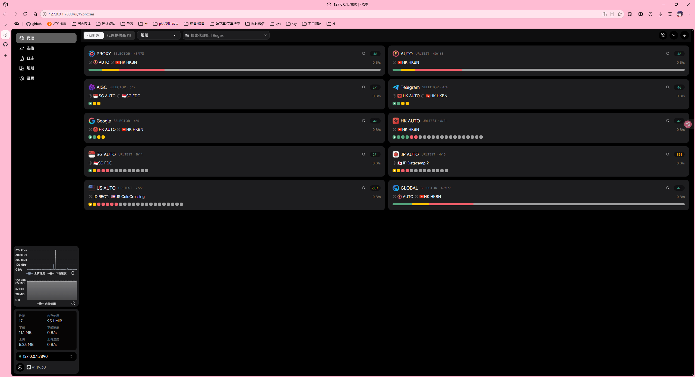
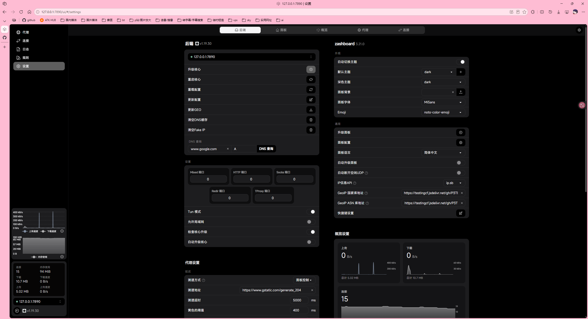

# clash_config

一个自用的 mihomo 内核配置文件，适合配合 Web 面板使用，整体界面清晰、规则管理方便，便于日常代理场景使用。

## 项目简介

- 适用于 mihomo / Clash Meta
- 支持多个订阅源统一管理
- 配置了常见规则分流与 DNS 处理
- 开启了 TUN 模式以提升兼容性
- 可直接搭配 Web 面板使用，便于查看节点与策略组状态

## 主要特性

- 订阅管理：支持多个 proxy-provider
- 分流规则：覆盖国内、Telegram、Google、OpenAI 等常见场景
- DNS 配置：启用 fake-ip 模式，兼容常见应用访问需求
- TUN 模式：适合需要系统级代理的使用场景
- 面板支持：可直接配合 Web 面板查看节点与界面状态

## 使用方式

1. 复制并修改 `config.yaml` 中的订阅地址。
2. 将 `your_subscription_url` 替换为自己的节点订阅链接。
3. 根据需要修改节点名称与策略组。
4. 启动 mihomo / Clash Meta。
5. 打开 Web 面板查看节点状态和规则效果。

> 说明：本配置为自用模板，实际订阅地址、节点名称和规则策略可按需调整。

## 界面预览

### 面板首页

### 节点与规则界面

## 备注

该配置适合有一定订阅管理与规则分流需求的用户使用。若需要进一步定制，例如按地区分流、增加机场策略组、优化 DNS 或规则优先级，可以在现有配置基础上继续扩展。